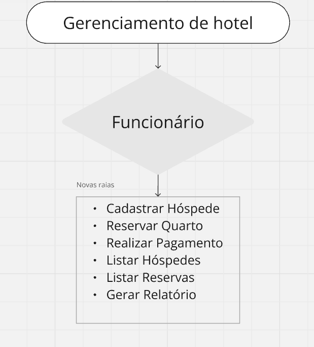
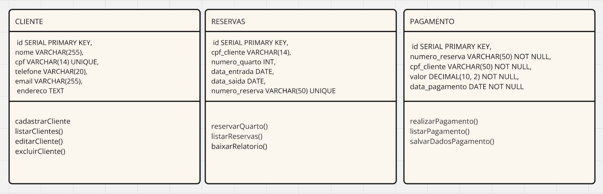
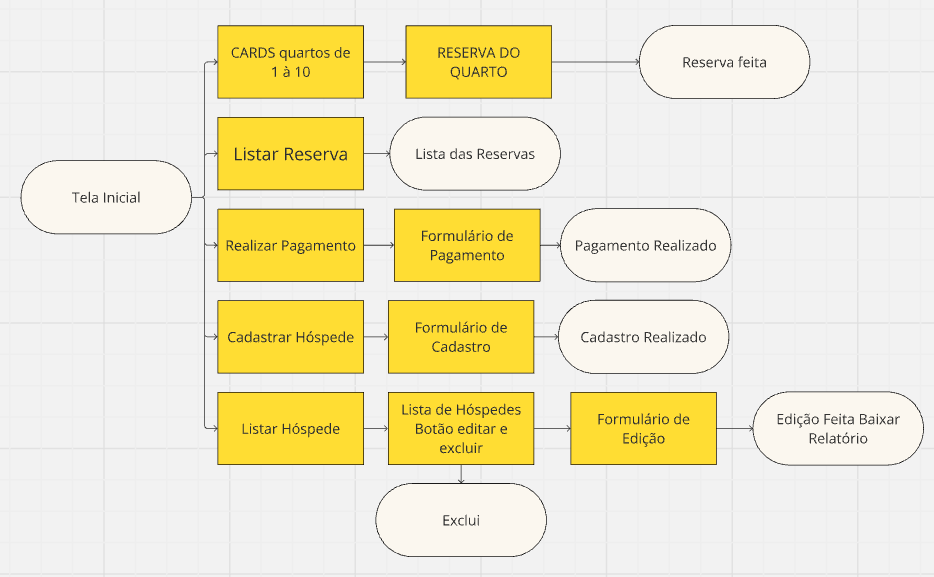

# SISTEMA DE GERENCIAMENTO DE HOTEL

### ESCOPO:

-
### OBJETIVOS: 
**Específicos:**

- Login do Funcionário;
- Cadastro de Hóspedes;
- Permitir que os funcionários cadastrem os hóspedes, realizem a reserva dos quartos e o pagamento da reserva;
- Listar hóspedes e permitir editar e excluir;
- Listar todas as reservas;
- Permitir que ao fazer a reserva do quarto,crie um arquivo com o número da reserva;
- Permitir que ao fazer o pagamento da reserva, crie um arquivo com o recibo.

**Mensuráveis:**

- Garantir que o sistema cadastre até 5 hospede;
- Garantir que o funcionário realize até 10 reservas;
- Garantir que o funcionário finalize até 5 pagamentos das reservas;
- Garantir que até 3 arquivos de número de reserva e recibo sejam criados.

**Atingíveis:**

- Utilizar Java e bibliotecas bem documentadas (Java Swing...) para assegurar o cumprimento dos prazos e qualidade do código.

**Relevantes:**

- 

# Análise de Riscos

## 1. Problemas Técnicos
**Risco:** O sistema pode apresentar lentidão, bugs ou até parar de funcionar, o que pode irritar os usuários.

**Mitigação:**
- Fazer muitos testes antes de lançar a plataforma.
- Monitorar o sistema o tempo todo para identificar e corrigir problemas rapidamente.
- Fazer backup dos dados regularmente e ter um plano para recuperar informações se algo der errado.

## 2. Segurança dos Dados
**Risco:** Dados pessoais e financeiros dos usuários podem ser roubados ou vazados.

**Mitigação:**
- Proteger os dados com criptografia.
- Seguir as regras de proteção de dados, como GDPR e LGPD.
- Fazer revisões regulares de segurança para manter o sistema seguro.

## 3. Engajamento de Usuários
**Risco:** Pode ser difícil atrair e manter organizadores de eventos e visitantes.

**Mitigação:**
- Criar uma boa estratégia de marketing para promover a plataforma.
- Oferecer promoções e parcerias para aumentar a visibilidade.
- Pedir feedback aos usuários e ajustar a plataforma para atender melhor suas necessidades.

## 4. Adoção pelos Organizadores
**Risco:** Se os organizadores de eventos não se interessarem pela plataforma, teremos poucos eventos listados.

**Mitigação:**
- Mostrar aos organizadores como a plataforma pode ser útil para eles.
- Garantir que a plataforma seja fácil de usar.
- Oferecer suporte e orientação para ajudar os organizadores a se familiarizarem com a plataforma.

### RECURSOS:

- Postgres Database
- Visual Studio Code
- Excel (Cronograma)
- Miro/Draw.io (Diagramas)
- Git/GitHub
- Equipe (Gerente de Projeto,Desenvolvedores Backend (2-3 membros),Desenvolvedores Frontend (2 membros),Designer UX/UI,Tester/QA (Controle de Qualidade))

### CRONOGRAMA:

### DIAGRAMA DE USO:

### DIAGRAMA DE CLASSE:

### DIAGRAMA DE FLUXO:

